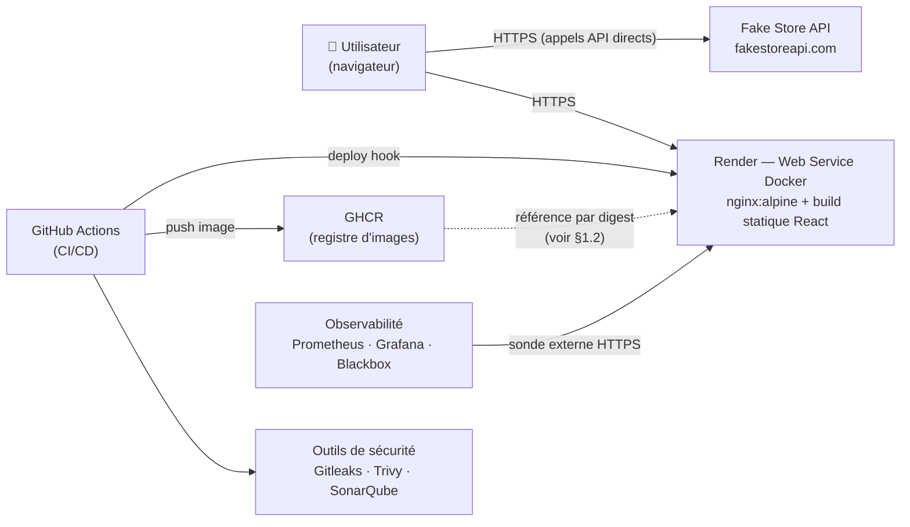
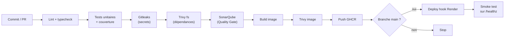

# Architecture et chaîne de valeur

> **Livrable 2** — diagramme d'architecture et diagramme de la chaîne de valeur.
> Documents liés : [rapport technique](rapport-technique.md) · [stratégie d'observabilité](observabilite.md)

---

## 1. Architecture cible

### 1.1 Le trajet d'une modification, du commit jusqu'à l'utilisateur

Une modification de code part d'une branche et d'une pull request. Le poussée déclenche
`.github/workflows/ci.yml`, qui exécute d'abord le job **`qualite`** : lint, vérification des types,
tests unitaires et de composants avec seuil de couverture, détection de secrets sur l'historique
complet, scan des dépendances, puis Quality Gate SonarQube. Tant que la pull request est ouverte,
c'est le seul job qui s'exécute jusqu'au bout : rien n'est publié, rien n'est déployé.

Si tout passe, le job **`image`** construit l'image Docker localement (`load: true`, sans
publication), la soumet à Trivy, et ne pousse sur GHCR qu'ensuite — et uniquement si la référence
est `refs/heads/main`. L'ordre est délibéré : publier puis scanner laisserait une image vulnérable
téléchargeable pendant l'intervalle, aussi court soit-il.

Après fusion sur `main`, le job **`deploiement`** s'exécute dans le GitHub Environment `production`,
seul détenteur du secret `RENDER_DEPLOY_HOOK_URL`. Il appelle le deploy hook de Render, attend la
reconstruction, puis sonde `/healthz` jusqu'à obtenir un `200`. Un hook accepté n'est qu'une
promesse : sans cette sonde finale, le pipeline serait vert alors que le service est cassé — cas
réellement rencontré lors du déplacement des chemins temporaires de nginx (commit `febf4c0`).

L'utilisateur reçoit alors la nouvelle version depuis nginx, qui sert les fichiers statiques et les
en-têtes de sécurité. Son navigateur appelle **directement** `fakestoreapi.com` : il n'y a aucun
backend intermédiaire, et la `Content-Security-Policy` n'autorise `connect-src` que vers ce seul
domaine. En parallèle, la stack d'observabilité sonde l'URL publique depuis l'extérieur et rend
visible l'effet de la mise en ligne sur la disponibilité et la latence.

### 1.2 Le lien en pointillés entre GHCR et Render

Le lien GHCR → Render est en pointillés parce qu'il documente une **intention partiellement
réalisée**. La conception prévoyait que Render tire l'image par son digest (`imgURL=...@sha256:...`),
garantissant que l'artefact en ligne est bit à bit celui que Trivy a scanné. Le service Render
finalement disponible sur l'offre gratuite est adossé au dépôt Git : il reconstruit l'image depuis le
`Dockerfile` du commit courant et refuse le paramètre `imgURL`.

Conséquence, consignée telle quelle dans le rapport : l'image publiée sur GHCR reste la référence
scannée et archivée, mais l'artefact servi par Render en est un **équivalent reconstruit depuis la
même source**, et non le même objet. La barrière de sécurité tient — le job de déploiement ne
s'exécute que si le scan a réussi sur ce commit précis — mais la preuve cryptographique
« image déployée = image scannée » n'est plus disponible. Voir
[rapport-technique.md §7](rapport-technique.md#7-conclusion--limites-actuelles-et-améliorations-futures).

---

## 2. Chaîne de valeur

### 2.1 Pourquoi cet ordre, et ce qu'il coûte à une modification

La chaîne est ordonnée par **coût croissant et par portée croissante des dégâts**. Le lint et la
vérification des types s'exécutent en quelques secondes et n'ont besoin d'aucun service externe :
ils échouent avant que l'on ait payé le prix d'un build d'image. Les tests viennent ensuite, car ils
demandent l'installation complète des dépendances mais restent hors réseau — l'interception par MSW
rend leur résultat indépendant de la disponibilité de Fake Store API.

Gitleaks est placé avant tout ce qui publie quoi que ce soit. Un secret commité est compromis dès
sa publication, même effacé au commit suivant ; c'est la seule étape dont l'échec ne peut pas être
rattrapé après coup, donc elle passe tôt et sur l'historique complet, pas seulement sur le diff.

Trivy `fs` puis SonarQube ferment le contrôle de la source. Le build d'image ne démarre qu'ensuite,
avec le cache GitHub Actions pour ne pas payer deux fois les mêmes couches. Trivy `image` complète
Trivy `fs` : le premier ne voit que `node_modules`, le second voit les paquets système de l'image de
base — deux surfaces distinctes qu'aucun des deux scans ne couvre seul.

Le losange `Branche main ?` est le point où la chaîne devient irréversible. Avant lui, tout est
vérification et peut être refait ; après lui, quelque chose est publié ou mis en ligne. C'est
exactement là que se situent la restriction de branche, le GitHub Environment et ses secrets.

Concrètement, pour une modification donnée : **quelques minutes de pipeline sur la pull request**,
puis, après fusion, **publication sur GHCR puis mise en ligne vérifiée** — la vérification
elle-même prenant l'essentiel du temps, puisque Render reconstruit l'image avant de basculer le
trafic. Le smoke test final est ce qui transforme « le pipeline est vert » en « l'utilisateur est
servi ».
