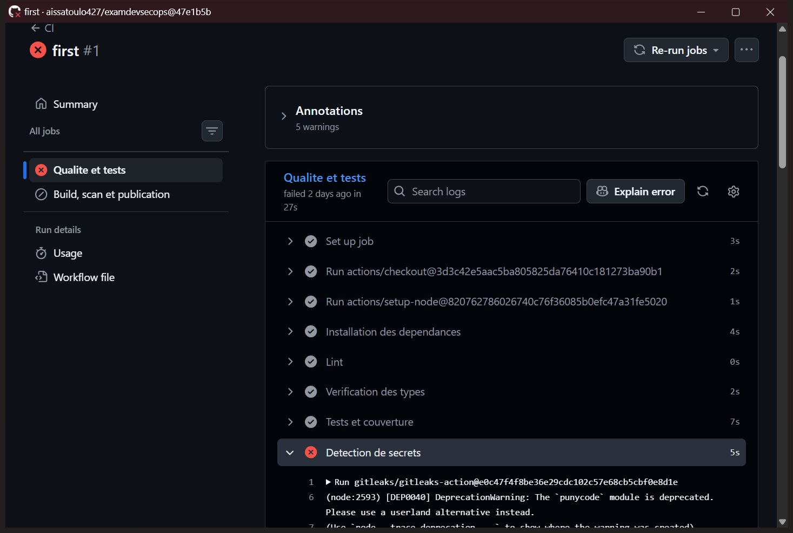
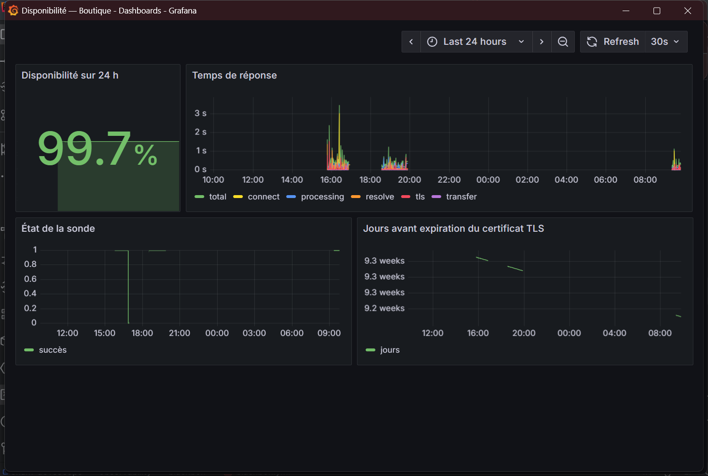

# Rapport technique — Chaîne DevSecOps pour une plateforme E-Commerce

> **Livrables 1 et 8** — rapport technique et conclusion sur les limites et améliorations futures.
> **Auteur :** Aissatou Lo · **Dépôt :** <https://github.com/aissatoulo427/examdevsecops> ·
> **Application :** <https://examdevsecops.onrender.com>
> Documents liés : [architecture](architecture.md) · [observabilité](observabilite.md)

---

## 1. Contexte et objectifs

Le sujet demande une plateforme e-commerce moderne, mais son cœur n'est pas l'application : c'est
**la chaîne de valeur** qui la porte du code source jusqu'à l'utilisateur, et le retour
d'information qui remonte dans l'autre sens. L'application est donc restée volontairement simple —
connexion, catalogue, panier, consommant la [Fake Store API](https://fakestoreapi.com) — pour que
l'effort porte là où il est évalué : le pipeline, la sécurité et l'observabilité.

Quatre objectifs ont guidé chaque décision, et servent de grille de lecture au reste du rapport.

| Objectif | Traduction concrète |
|---|---|
| **Vitesse** | Une modification fusionnée est en ligne sans intervention manuelle ; les défauts sont signalés en secondes, pas en revue de code |
| **Fiabilité** | Un pipeline vert signifie que le service répond réellement ; il n'échoue jamais pour une cause extérieure au dépôt |
| **Sécurité** | Aucun secret dans le dépôt ni dans l'image ; rien n'est publié sans avoir été scanné |
| **Reproductibilité** | Un tiers reconstruit et exécute l'ensemble — application, pipeline, observabilité — à partir du dépôt seul, sans accès à une infrastructure personnelle |

Le dernier objectif est celui qui a le plus modelé l'architecture, et il explique les deux
renoncements décrits en section 2.

---

## 2. Architecture retenue et alternatives écartées

### 2.1 L'architecture retenue

Une application React 19 construite par Vite, servie en fichiers statiques par nginx dans un
conteneur durci, déployée sur Render. Le navigateur appelle Fake Store API **directement**, sans
backend intermédiaire. GitHub Actions contrôle, teste, scanne, construit et publie l'image sur GHCR,
puis déclenche le déploiement. Une stack Prometheus / Grafana / blackbox-exporter, exécutable
localement, sonde l'URL publique depuis l'extérieur.

Le détail des flux et le trajet d'une modification figurent dans
[`docs/architecture.md`](architecture.md).

### 2.2 Alternative écartée : le VPS personnel

La première conception visait un déploiement par SSH sur un VPS personnel, avec une instance
SonarQube auto-hébergée derrière son nginx.

Elle a été abandonnée pour une raison qui n'est pas technique mais structurelle : **elle rendait le
projet non reproductible.** Un correcteur, ou n'importe quel tiers, n'aurait pas pu rejouer la
chaîne sans accès à ce serveur. S'y ajoutaient trois coûts concrets — modifier la configuration
nginx d'une machine portant d'autres applications en production, donc y prendre un risque
d'indisponibilité pour un projet d'examen ; gérer une clé SSH de déploiement dans les secrets
GitHub, c'est-à-dire le secret dont la fuite est la plus lourde de conséquences ; et ajouter deux
secrets supplémentaires pour franchir le Basic Auth de SonarQube.

Le passage à **Render** et à **SonarQube Cloud** supprime les trois. L'authentification de
déploiement se réduit à une URL de hook, celle de l'analyse à un seul token, et le projet ne dépend
plus d'aucune infrastructure personnelle. Le gain visé est la reproductibilité, et
accessoirement une réduction nette de la surface de secrets.

### 2.3 Alternative écartée : le Static Site

Render propose des sites statiques gratuits, plus simples et plus rapides à mettre en ligne qu'un
Web Service Docker. Cette option a été écartée parce que le sujet demande un frontend
**conteneurisé** : passer par un Static Site aurait fait disparaître du schéma d'architecture le
`Dockerfile`, le durcissement de l'image et le scan Trivy `image` — c'est-à-dire une part
substantielle de ce qui est évalué. Le coût du choix retenu est un temps de déploiement plus long,
puisque l'image doit être reconstruite ; le gain est que la chaîne de sécurité de l'image existe
réellement au lieu d'être décrite.

### 2.4 Alternative écartée : un backend intermédiaire

Un petit backend aurait permis de garder le JWT hors du navigateur, dans un cookie `HttpOnly`.
Il a été écarté : le sujet demande la consommation directe de Fake Store API, et un backend ajouterait
un service à construire, scanner, déployer et observer, pour une application dont ce n'est pas
l'objet. Le gain de cette absence est une surface d'attaque entière en moins ; sa contrepartie est
la limite du JWT côté client, traitée en 4.4 et reprise en conclusion.

---

## 3. La chaîne CI/CD étape par étape

Un seul workflow, [`.github/workflows/ci.yml`](../.github/workflows/ci.yml), déclenché sur pull
request et sur push vers `main`. Trois jobs enchaînés : `qualite`, `image`, `deploiement`.

Les étapes sont ordonnées par **coût croissant** : les contrôles rapides et sans dépendance externe
d'abord, ceux qui construisent ou publient ensuite. Une erreur de syntaxe ne doit pas coûter un
build d'image pour être découverte.

| # | Étape | Outil | Bloquant | Gain visé |
|---|---|---|---|---|
| 1 | Lint | oxlint | oui | **Vitesse** — les défauts de style et les erreurs évidentes sortent en secondes, et ne consomment plus de temps de revue humaine |
| 2 | Vérification des types | `tsc -b --noEmit` | oui | **Fiabilité** — toute une classe d'erreurs d'exécution devient impossible à fusionner |
| 3 | Tests + couverture | Vitest, MSW | oui, avec seuil | **Fiabilité** — le seuil empêche la couverture du cœur métier de se dégrader silencieusement au fil des ajouts |
| 4 | Détection de secrets | Gitleaks, historique complet | oui | **Sécurité** — un secret commité est compromis dès sa publication ; c'est le seul défaut qu'un correctif ultérieur ne rattrape pas |
| 5 | Scan des dépendances | Trivy `fs` (HIGH, CRITICAL) | oui | **Sécurité** — l'essentiel du code livré vient de `node_modules`, pas du dépôt |
| 6 | Qualité et SAST | SonarQube Cloud, Quality Gate | oui | **Fiabilité** — une règle objective et non négociable remplace un avis en revue |
| 7 | Construction locale de l'image | Docker Buildx, cache GHA | oui | **Vitesse** — le cache évite de repayer les couches inchangées à chaque exécution |
| 8 | Scan de l'image | Trivy `image` (HIGH, CRITICAL) | oui | **Sécurité** — le scan des dépendances ignore les paquets système de l'image de base, autre surface entièrement |
| 9 | Publication | GHCR | `main` uniquement | **Traçabilité** — chaque image publiée porte le SHA du commit dont elle est issue |
| 10 | Déploiement | Deploy hook Render, environment `production` | `main` uniquement | **Vitesse** — plus aucune étape manuelle entre la fusion et la mise en ligne |
| 11 | Vérification post-déploiement | `curl` sur `/healthz`, 40 tentatives | oui | **Fiabilité** — sans elle, le pipeline serait vert alors que le service est cassé |

Trois points d'implémentation méritent d'être justifiés plutôt que listés.

**L'image est construite puis scannée avant d'être publiée**, jamais l'inverse. Le job `image`
construit d'abord en local (`load: true`), passe Trivy, et ne pousse sur GHCR qu'ensuite. Publier
puis scanner laisserait une image vulnérable téléchargeable pendant l'intervalle, aussi bref
soit-il — et un registre public n'oublie pas ce qui y a été poussé.

**Gitleaks inspecte l'historique complet**, ce qui impose `fetch-depth: 0` au checkout. Se limiter
au diff de la pull request laisserait passer un secret introduit puis supprimé dans la même branche,
alors qu'il reste lisible dans l'historique — donc compromis.

**Le déploiement n'est acquis qu'après vérification.** Un hook accepté est une promesse, pas une
mise en ligne. Le pipeline attend 90 secondes que Render reconstruise, puis sonde `/healthz`
jusqu'à obtenir un `200`. Cette étape n'a pas été ajoutée par principe : elle vient d'un incident
réel où nginx refusait de démarrer sur Render à cause de ses chemins temporaires, avec un pipeline
resté vert (corrigé au commit `febf4c0`).

---

## 4. Stratégie de sécurité — quatre niveaux

La sécurité n'est pas une étape du pipeline, c'est une propriété qui doit tenir à quatre niveaux
distincts. Chacun a ses défaillances propres, qu'aucun des trois autres ne rattrape.

### 4.1 Niveau 1 — le code

**SonarQube Cloud** analyse chaque exécution et applique une Quality Gate bloquante : bugs, code
smells, vulnérabilités et duplication. Le choix du service géré plutôt que d'une instance
auto-hébergée relève de la même logique que Render (section 2.2) — un token unique au lieu de deux
secrets et d'une configuration nginx à modifier.

Le point important n'est pas l'outil mais le caractère **bloquant** de la porte. Un rapport de
qualité consultatif est lu les premières semaines puis ignoré ; une porte qui refuse la fusion est
la seule forme de règle qui tient dans la durée.

`oxlint` et `tsc --noEmit` complètent en amont, sur un registre différent : la cohérence de style et
la sûreté du typage.

### 4.2 Niveau 2 — les secrets

Trois secrets seulement, et aucun dans le dépôt.

| Secret | Portée | Usage |
|---|---|---|
| `SONAR_TOKEN` | dépôt | Analyse SonarQube Cloud |
| `RENDER_DEPLOY_HOOK_URL` | environment `production` | Déclenchement du déploiement |
| `GITHUB_TOKEN` | fourni automatiquement, par job | Publication sur GHCR |

**Gitleaks** vérifie l'historique complet à chaque exécution. Sa configuration
[`.gitleaks.toml`](../.gitleaks.toml) étend le jeu de règles par défaut au lieu de le remplacer :
une configuration écrite de zéro perdrait silencieusement les centaines de règles maintenues en
amont, et une régression silencieuse dans un outil de sécurité est pire que son absence.

Deux exclusions sont déclarées, **par valeur exacte et non par chemin de fichier** : la clé de
projet SonarQube (publique par nature, elle doit être versionnée pour que le scanner la lise) et
les identifiants de démonstration Fake Store API `mor_2314` / `83r5^_` (publics, documentés par
l'API, n'ouvrant l'accès à aucune donnée réelle). Exclure par chemin aurait créé des zones aveugles
permanentes : avec une exclusion par valeur, un véritable secret déposé dans ces mêmes fichiers
reste détecté.

Le secret de déploiement est porté par un **GitHub Environment** `production`, et non par le dépôt.
La différence est de nature : une pull request, y compris ouverte depuis un fork par un tiers, ne
peut ni le lire ni déclencher de déploiement. Sans cela, un contributeur extérieur pourrait
exfiltrer l'URL du hook par une simple modification du workflow.

*Gitleaks bloquant une pull request : le job échoue, la fusion est impossible tant que le secret
n'est pas retiré de l'historique.*

### 4.3 Niveau 3 — la chaîne d'approvisionnement

C'est le niveau le plus souvent négligé, et celui où un compromis est le plus difficile à détecter,
puisque le code du dépôt reste inchangé.

- **Images de base épinglées par digest** (`node:22-alpine@sha256:...`,
  `nginx:1.29-alpine@sha256:...`) et non par tag. Un tag peut être redirigé vers un autre contenu ;
  un digest est une empreinte cryptographique immuable.
- **Actions GitHub épinglées par SHA de commit** et non par tag, pour exactement la même raison.
  Une action tierce s'exécute avec l'accès au dépôt et aux secrets du job : c'est du code de
  confiance, il doit être figé comme tel.
- **`npm ci`** et non `npm install`, pour installer strictement ce que verrouille
  `package-lock.json`.
- **Trivy à deux endroits** — sur le système de fichiers et sur l'image. Les deux scans ne voient
  pas la même chose : le premier couvre les dépendances npm, le second les paquets système de
  l'image de base.
- **`permissions:` minimales** — `contents: read` par défaut au niveau du workflow ;
  `packages: write` uniquement sur le job qui publie. Un jeton trop large est exploitable par
  n'importe quelle dépendance exécutée pendant le build.
- **`concurrency`** avec annulation des exécutions obsolètes, pour qu'une ancienne exécution ne
  puisse pas déployer par-dessus une plus récente.

Un compromis a été assumé ici et mérite d'être nommé : le `Dockerfile` exécute `apk --no-cache
upgrade` sur l'étape runtime. Sans cela, l'image `nginx:alpine` épinglée embarque des paquets
système dont les correctifs existent déjà en amont, et Trivy bloque la publication. Cette
instruction **affaiblit la reproductibilité bit à bit** — la version exacte des paquets dépend de la
date de construction — au profit de l'application effective des correctifs. Entre une image
parfaitement reproductible et vulnérable, et une image corrigée dont l'empreinte varie, le second
terme a été retenu ; la traçabilité est préservée par le digest publié à chaque build.

### 4.4 Niveau 4 — l'exécution

L'image est durcie par construction :

- **exécution non-root** (`USER nginx`), et écoute sur le port 8080 puisqu'un processus non
  privilégié ne peut pas se lier sous 1024 ;
- **système de fichiers racine en lecture seule**, `no-new-privileges`, `cap_drop: ALL` — les
  chemins temporaires de nginx sont redirigés sous `/var/cache/nginx`, seul répertoire inscriptible ;
- **`.dockerignore`** excluant `node_modules`, `.git`, `docs`, `observability`, `*.pdf` et tout
  fichier `.env` : ce qui n'entre pas dans le contexte de build ne peut pas fuir dans une couche ;
- **aucun secret ni fichier `.env`** dans l'image — l'application est statique, elle n'en a besoin
  d'aucun.

Au niveau du navigateur, nginx sert cinq en-têtes ([`nginx.conf`](../nginx.conf)) :
`Content-Security-Policy`, `X-Content-Type-Options`, `X-Frame-Options`, `Referrer-Policy`,
`Permissions-Policy`. Le plus significatif est la CSP, dont `connect-src` n'autorise que
`'self'` et `https://fakestoreapi.com`. C'est la traduction en politique navigateur d'un fait
d'architecture : l'application n'a qu'une seule sortie réseau légitime. Un script injecté ne
pourrait exfiltrer les données vers aucune autre destination.

Enfin, le **JWT ne va jamais dans `localStorage`**. L'état React fait autorité, et `sessionStorage`
ne sert qu'à survivre à un rafraîchissement de page. Un `localStorage` survivrait à la fermeture de
l'onglet et resterait lisible par tout script s'exécutant sur l'origine, bien après la fin de la
session. Un test dédié vérifie explicitement cette propriété, pour qu'une régression future soit
signalée par le pipeline et non découverte en production.

---

## 5. Stratégie de test

| Niveau | Outil | Ce qui est couvert |
|---|---|---|
| Unitaire | Vitest | Réducteur du panier : ajout, retrait, quantités, total, cas limites |
| Unitaire | Vitest | Service d'authentification : succès, échec 401, absence du token dans `localStorage` |
| Composant | Testing Library | Catalogue, formulaire de connexion, page panier, garde de route |
| Réseau | MSW | Interception de tous les appels à Fake Store API |

**41 tests répartis sur 7 fichiers**, exécutés à chaque poussée.

### 5.1 Le seuil de couverture est ciblé, pas global

Le seuil bloquant est fixé à **80 % de lignes et de branches sur `src/cart/` et `src/auth/`**
uniquement, sans seuil global ([`vite.config.ts`](../vite.config.ts)).

C'est un choix, pas un renoncement. Un seuil global élevé pousse mécaniquement à écrire des tests de
rendu sans valeur — monter un composant, vérifier qu'il ne plante pas — pour atteindre un chiffre.
Le résultat est une couverture flatteuse et une suite de tests qui ne détecte rien. En ciblant la
logique du panier et l'authentification, le seuil protège exactement ce dont la régression coûte
cher : le calcul d'un total et le traitement d'un jeton.

Ce ciblage est rendu possible par une décision d'architecture : le panier est un **réducteur pur**,
sans dépendance à React ni au réseau. Il peut donc être testé directement, sans monter de composant
ni simuler d'événements — les tests les plus rapides à écrire et les plus lents à casser pour de
mauvaises raisons.

La couverture mesurée dépasse largement le seuil (97,5 % de lignes, 86,7 % de branches sur
l'ensemble), mais c'est le seuil qui compte : il définit ce qui est garanti dans la durée, pas ce
qui se trouve vrai aujourd'hui.

### 5.2 MSW conditionne la fiabilité du pipeline

Mock Service Worker intercepte les appels réseau au niveau de la couche `fetch`, et non en
remplaçant le module client. La différence est déterminante : le code testé est **exactement** celui
qui s'exécute en production, y compris la construction des URL, la sérialisation JSON et le
traitement des codes d'erreur. Remplacer le module client testerait le remplacement, pas le client.

Mais la raison principale de sa présence est ailleurs. **Sans MSW, la CI dépendrait de la
disponibilité d'un service tiers gratuit.** Un pipeline qui rougit parce que `fakestoreapi.com` est
momentanément indisponible n'est pas fiable — et un pipeline non fiable produit le pire résultat
possible : il entraîne l'équipe à relancer les échecs sans les lire, jusqu'au jour où l'échec est
réel. MSW garantit qu'un pipeline rouge signifie toujours « le code a un problème », jamais
« l'Internet a un problème ». C'est une décision de fiabilité, pas de confort.

Il permet en outre de tester ce que l'API réelle ne fournit pas à la demande : une erreur 401 sur
mauvais identifiants, une panne réseau, une réponse malformée — des cas qui, sans simulation,
resteraient non testés parce qu'ils sont non reproductibles.

---

## 6. Observabilité

Traitée en détail dans **[`docs/observabilite.md`](observabilite.md)** : indicateurs suivis et leur
justification, choix d'une sonde externe, règles d'alerte et seuils, traitement des logs, limite
mesurée du plan gratuit.

En résumé : une stack Prometheus / Grafana / blackbox-exporter livrée as-code dans
[`observability/`](../observability), démarrée par un `docker compose up`, sondant l'URL publique
depuis l'extérieur toutes les 30 secondes. Quatre indicateurs — disponibilité, latence par phase,
validité TLS, code de réponse — et trois règles d'alerte. Sources de données et tableau de bord sont
provisionnés automatiquement : aucune création à la souris, donc un résultat identique sur n'importe
quelle machine.

*Tableau de bord « Disponibilité — Boutique » : taux de réussite sur 24 h, temps de réponse par
phase, état de la sonde et jours restants avant expiration du certificat TLS.*

---

## 7. Conclusion — limites actuelles et améliorations futures

La chaîne remplit ses quatre objectifs : une modification fusionnée sur `main` arrive en ligne sans
intervention manuelle et avec une mise en ligne vérifiée ; onze contrôles bloquants la précèdent ;
aucun secret ne réside dans le dépôt ni dans l'image ; et l'ensemble — application, pipeline,
observabilité — se rejoue depuis le dépôt seul.

Elle a aussi des limites. Elles sont énoncées ici avec leur remède, parce qu'une limite connue et
mesurée coûte toujours moins cher qu'une limite ignorée.

### 7.1 L'image déployée n'est pas bit à bit celle qui a été scannée

**C'est la limite la plus importante du projet.** La conception prévoyait que Render tire l'image
par son digest (`imgURL=...@sha256:...`), établissant par empreinte cryptographique que l'artefact
en ligne est exactement celui que Trivy a validé. Le service disponible sur l'offre gratuite est
adossé au dépôt Git : il reconstruit l'image depuis le `Dockerfile` du commit courant et refuse le
paramètre `imgURL` (le hook répond `400`).

Ce qui subsiste : le job de déploiement ne s'exécute que si le scan a réussi **sur ce même commit**,
et l'image scannée est publiée sur GHCR, donc archivée et vérifiable. Ce qui est perdu : la preuve
que l'artefact servi est le même objet, et non son équivalent reconstruit depuis la même source.
S'y ajoute l'effet du `apk upgrade` décrit en 4.3, qui fait varier les paquets système selon la date
de construction — deux builds du même commit ne produisent donc pas nécessairement le même digest.

**Remède :** un service Render de type *image-backed*, disponible sur l'offre payante, restaure le
déploiement par digest et rétablit la garantie complète, sans aucune modification du pipeline autre
que la réintroduction du paramètre `imgURL` déjà écrit et testé.

### 7.2 Le service est suspendu après 15 minutes d'inactivité

L'offre gratuite Render suspend le service, dont le réveil prend de l'ordre de la minute. Les sondes
enregistrent des indisponibilités apparentes et des latences supérieures à 5 secondes.

**Remède :** offre payante Render (à partir de 7 USD par mois) pour supprimer la suspension. Le
contournement par requête périodique de maintien en éveil est écarté : il verdirait le tableau de
bord au prix de la validité de la mesure. Détail en
[`observabilite.md §5`](observabilite.md#5-la-limite-mesurée-du-plan-gratuit).

### 7.3 Le JWT vit côté client

Sans backend, le jeton est nécessairement manipulé par le navigateur. Les mitigations appliquées —
état React faisant autorité, `sessionStorage` plutôt que `localStorage`, CSP restreignant
`connect-src` — réduisent la fenêtre d'exposition sans la fermer : un script injecté s'exécutant sur
l'origine peut toujours lire `sessionStorage`.

**Remède :** un BFF minimal détenant le jeton dans un cookie `HttpOnly`, `Secure`, `SameSite=Strict`,
inaccessible à tout JavaScript. Coût : un service supplémentaire à construire, scanner, déployer et
observer — d'où sa mise hors périmètre, assumée plutôt que subie.

### 7.4 Ni signature d'image ni SBOM

Le pipeline scanne l'image mais ne la signe pas, et ne produit pas d'inventaire de ses composants.
Rien n'empêcherait donc un tiers ayant accès au registre d'y substituer une image, ni ne permettrait
de répondre rapidement à « cette image contient-elle la bibliothèque touchée par cette CVE ? ».

**Remède :** **Cosign** en signature keyless (OIDC GitHub Actions, sans clé à stocker) et **Syft**
pour un SBOM CycloneDX attaché à l'image, avec vérification de la signature avant déploiement. Deux
étapes de workflow, aucun secret supplémentaire.

### 7.5 Aucun test de bout en bout

Les tests couvrent les unités et les composants, mais aucun ne pilote un navigateur réel sur
l'application construite. Un défaut d'intégration entre pages — un parcours connexion → catalogue →
panier cassé par une modification de routage — passerait la CI.

**Remède :** **Playwright** sur trois parcours seulement (connexion, ajout au panier, calcul du
total), exécutés contre le conteneur démarré dans la CI. Trois scénarios stables valent mieux
qu'une suite exhaustive et instable, dont les échecs aléatoires finissent par être ignorés.

### 7.6 Aucun rollback automatique

Si une version déployée passe tous les contrôles mais se révèle défaillante en production, le retour
à la version précédente est manuel, via le dashboard Render.

**Remède :** un job conditionné à l'échec du smoke test, rappelant le hook sur le commit précédent ;
et, sur une offre image-backed, un redéploiement du digest précédent — instantané, puisque l'image
est déjà construite et publiée sur GHCR.

### 7.7 Dépendance à un service tiers gratuit pour les données

Fake Store API n'offre aucune garantie de disponibilité. La CI en est immunisée par MSW, mais
l'application en production ne l'est pas : si l'API tombe, le catalogue est vide.

**Remède :** à ce niveau d'enjeu, l'affichage explicite d'un état d'erreur — déjà implémenté par
`ApiError`, qui unifie panne réseau et réponse d'erreur — est la réponse proportionnée. Un cache
côté serveur supposerait le backend écarté en 2.4.

### 7.8 Le panier n'est pas persistant

Le panier vit dans l'état React et disparaît au rafraîchissement de la page. La conception initiale
prévoyait une persistance dans `localStorage` pour les articles seuls, sans donnée personnelle ;
elle n'a pas été implémentée.

**Remède :** sérialiser l'état du réducteur dans `localStorage` à chaque modification et le relire à
l'initialisation. Le réducteur étant pur, le changement est local et entièrement testable sans
monter de composant — quelques lignes et deux tests.

### 7.9 Les alertes ne notifient personne

Les trois règles Prometheus s'évaluent et s'affichent dans Grafana, mais aucun canal de notification
n'est configuré : personne n'est prévenu hors consultation du tableau de bord.

**Remède :** un **Alertmanager** dans la même `docker-compose.yml`, routant vers un webhook Slack ou
un courriel. Reporté parce qu'il suppose un secret de destination, et donc une configuration non
reproductible telle quelle par un tiers — le critère qui a guidé tout le reste du projet.

---

### Ce que la chaîne apprend en priorité

Si une seule amélioration devait être menée, ce serait la **7.1** : c'est la seule qui touche à une
propriété de sécurité démontrable plutôt qu'à un confort d'exploitation. Toutes les autres
ajoutent de la couverture ; celle-là restaure une preuve.

Le second enseignement tient dans la limite 7.2. Une chaîne d'observabilité qui fonctionne
commence par afficher des indicateurs dégradés — et c'est le signe qu'elle mesure quelque chose. Un
tableau de bord toujours vert est presque toujours un tableau de bord qui ne mesure rien.
