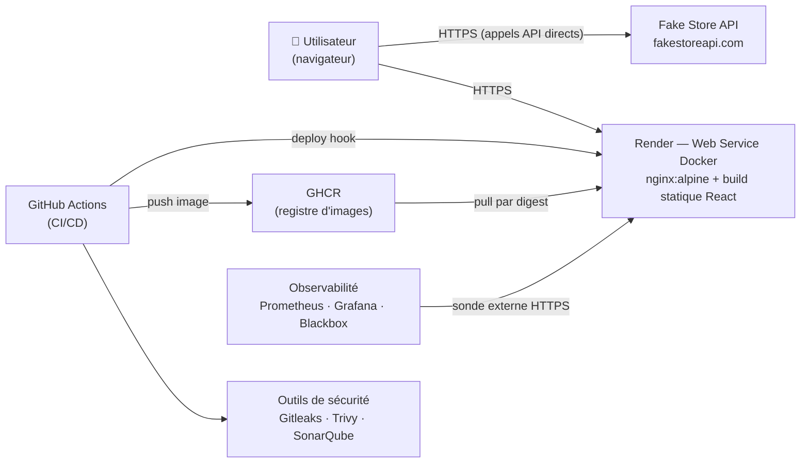
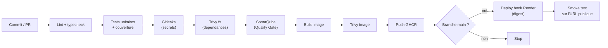

# Spécification — Chaîne DevSecOps pour une plateforme E-Commerce

**Date :** 2026-08-16
**Auteur :** Aissatou Lo
**Contexte :** Examen / Projet « Ingénierie DevSecOps — Déploiement d'une plateforme E-Commerce Moderne »
**Dépôt :** https://github.com/aissatoulo427/examdevsecops

---

## 1. Objectif

Livrer une application frontend conteneurisée consommant la [Fake Store API](https://fakestoreapi.com/docs),
ainsi que **l'intégralité de la chaîne de valeur** permettant de la livrer de façon rapide, sécurisée,
observable et reproductible — du code source jusqu'au feedback de production.

Le cœur du sujet n'est pas l'application : c'est la chaîne. L'application doit rester volontairement
simple pour que l'effort porte sur le pipeline, la sécurité et l'observabilité.

### Correspondance avec les livrables attendus

| # | Livrable | Où il est produit |
|---|----------|-------------------|
| 1 | Rapport technique | `docs/rapport-technique.md` |
| 2 | Diagramme chaîne de valeur + architecture | `docs/architecture.md` (Mermaid) |
| 3 | Dépôt Git : code + configurations | Ce dépôt |
| 4 | Pipeline CI/CD fonctionnel | `.github/workflows/ci.yml` |
| 5 | Tests automatisés | `src/**/*.test.ts(x)`, config Vitest |
| 6 | Configurations de sécurité | Étapes CI + `Dockerfile` + `nginx.conf` + `sonar-project.properties` |
| 7 | Stratégie d'observabilité | `docs/observabilite.md` + `observability/` |
| 8 | Conclusion : limites et améliorations | `docs/rapport-technique.md` §Conclusion |

---

## 2. Périmètre

### Dans le périmètre

- Application React consommant Fake Store API : authentification, catalogue, panier
- Conteneurisation multi-stage et durcissement de l'image
- Pipeline GitHub Actions : qualité, tests, scans de sécurité, build, publication, déploiement
- Publication sur GitHub Container Registry (GHCR)
- Déploiement continu sur Render
- Stack d'observabilité livrée as-code, exécutable localement
- Documentation : rapport, diagrammes, stratégie d'observabilité, conclusion

### Hors périmètre (décidé explicitement)

Ces éléments ont été écartés pour rester au niveau demandé par le sujet. Ils figureront dans
la section « améliorations futures » du rapport, ce qui vaut mieux que de les implémenter à moitié.

- Backend / BFF : le navigateur appelle Fake Store API directement
- Signature d'images (Cosign) et SBOM (Syft)
- Tests E2E (Playwright)
- Rollback automatique et annotations de déploiement dans Grafana
- Collecte des Web Vitals (RUM)
- Orchestration Kubernetes

### Nettoyage préalable

Le dépôt contient un squelette Spring Boot (`pom.xml`, `mvnw`, `mvnw.cmd`, `.mvn/`, `src/main/java/`,
`src/test/java/`, `HELP.md`) issu d'une initialisation abandonnée. Il est **supprimé** : l'option
retenue est un frontend pur, sans composant Java.

---

## 3. Architecture cible



### Décisions structurantes

**Aucun backend.** Le navigateur appelle Fake Store API directement. C'est fidèle au sujet et cela
supprime une surface d'attaque entière. La contrepartie est que le JWT vit côté client :

- il est conservé **en mémoire** (contexte React), avec repli sur `sessionStorage` ;
- **jamais** dans `localStorage` — un `localStorage` survit à la fermeture de l'onglet et reste
  lisible par tout script injecté ;
- la Content Security Policy n'autorise `connect-src` que vers `https://fakestoreapi.com`, ce qui
  documente la seule sortie réseau légitime de l'application.

**Frontend conteneurisé, pas Static Site.** Render propose des sites statiques gratuits, plus simples,
mais le sujet exige un frontend *conteneurisé* dans le schéma d'architecture. On prend donc un
Web Service Docker.

**Le déploiement passe obligatoirement par la CI.** L'auto-déploiement de Render sur `git push` est
désactivé : il déploierait même quand les scans échouent, ce qui viderait le pipeline de sa raison
d'être. Seul le job de déploiement, exécuté après les contrôles, appelle le deploy hook.

---

## 4. Application

### Fonctionnalités

| Écran | Comportement | Endpoint |
|-------|--------------|----------|
| Connexion | Formulaire identifiant / mot de passe, stockage du JWT | `POST /auth/login` |
| Catalogue | Liste des produits, filtrage par catégorie, détail | `GET /products`, `GET /products/categories` |
| Panier | Ajout, retrait, modification des quantités, total | État client (`localStorage` pour les articles uniquement, sans donnée personnelle) |

Les identifiants de démonstration de Fake Store API (par exemple `mor_2314` / `83r5^_`) sont
documentés dans le `README.md`. Ce ne sont pas des secrets : ils sont publics et fournis par l'API.

### Structure

```
src/
├── main.tsx, App.tsx
├── api/            client HTTP, typage des réponses Fake Store
├── auth/           contexte d'authentification, route protégée
├── cart/           logique du panier (réducteur pur, testable isolément)
├── catalog/        liste, filtre, détail produit
└── components/     éléments d'interface partagés
```

La logique du panier est un **réducteur pur**, sans dépendance à React ni au réseau. C'est le cœur
métier, donc la partie qui mérite le plus de tests, et elle doit pouvoir être testée sans monter
de composant.

---

## 5. Conteneurisation

Dockerfile multi-stage :

1. **Étape build** — `node:22-alpine`, `npm ci` (verrouillé par `package-lock.json`), `npm run build`
2. **Étape runtime** — `nginx:alpine` servant uniquement les fichiers statiques produits

Durcissement appliqué :

- images de base **épinglées par digest** (`@sha256:...`), pas par tag mouvant
- exécution **non-root**
- système de fichiers en lecture seule, `no-new-privileges`, `cap_drop: ALL`
- aucun secret ni fichier `.env` dans l'image
- `.dockerignore` excluant `node_modules`, `.git`, `docs`

En-têtes de sécurité servis par nginx : `Content-Security-Policy`, `X-Content-Type-Options`,
`X-Frame-Options`, `Referrer-Policy`, `Permissions-Policy`.

Un endpoint `/healthz` renvoie `200` sans journalisation : il sert à la fois à la sonde Render et
à la sonde blackbox.

---

## 6. Pipeline CI/CD

Un seul workflow, `.github/workflows/ci.yml`, déclenché sur pull request et sur push vers `main`.



| Étape | Outil | Bloquant | Justification |
|-------|-------|----------|---------------|
| Lint + typecheck | ESLint, `tsc --noEmit` | oui | Défauts détectés en secondes plutôt qu'en production |
| Tests + couverture | Vitest | oui, avec seuil | Empêche la couverture de se dégrader silencieusement |
| Secrets | Gitleaks (historique complet) | oui | Un secret commité est compromis même après suppression |
| Dépendances | Trivy `fs` | oui (HIGH/CRITICAL) | La majorité du code livré vient de `node_modules` |
| Qualité + SAST | SonarQube | oui (Quality Gate) | Règle objective et non négociable, plutôt qu'un avis en revue |
| Build | Docker Buildx + cache GHA | oui | Cache : temps de pipeline réduit |
| Scan image | Trivy `image` | oui (HIGH/CRITICAL) | Le scan des dépendances ignore les paquets système de l'image de base |
| Publication | GHCR | — | Package public, aucun identifiant de registre nécessaire |
| Déploiement | Deploy hook Render | `main` uniquement | Voir ci-dessous |
| Smoke test | `curl` sur `/healthz` | oui | Vérifie que le déploiement sert réellement du trafic |

### Traçabilité du déploiement

Le deploy hook de Render accepte un paramètre `imgURL`. La CI l'appelle avec le **digest** de l'image
qu'elle vient de scanner :

```
POST https://api.render.com/deploy/srv-xxxx?key=yyyy&imgURL=ghcr.io/aissatoulo427/examdevsecops@sha256:...
```

Cela garantit une propriété forte et démontrable : **l'image déployée est exactement celle qui a été
scannée**, prouvée par son empreinte cryptographique. Un déploiement par tag mouvant (`latest`)
n'offrirait pas cette garantie.

### Durcissement du pipeline lui-même

- actions tierces **épinglées par SHA de commit**, pas par tag — un tag peut être redirigé vers du code hostile
- `permissions:` déclarées au minimum nécessaire sur chaque job (`contents: read`, et `packages: write` sur le seul job de publication)
- secrets exposés par job, jamais globalement
- concurrence limitée pour éviter deux déploiements simultanés

---

## 7. Sécurité

### Secrets

| Secret GitHub | Usage |
|---------------|-------|
| `SONAR_TOKEN` | Token d'analyse SonarQube Cloud |
| `RENDER_DEPLOY_HOOK_URL` | URL du hook, contenant sa propre clé |
| `GITHUB_TOKEN` | Fourni automatiquement ; publication GHCR |

Règles appliquées : aucun secret dans le dépôt ni dans l'image ; Gitleaks vérifie l'historique complet
à chaque exécution ; les secrets liés au déploiement sont portés par un GitHub Environment `production`,
ce qui les rend inaccessibles aux workflows de pull request — donc à une PR ouverte par un tiers.

### SonarQube Cloud

L'analyse de qualité est confiée à **SonarQube Cloud**, gratuit pour les dépôts publics.

Une instance auto-hébergée était disponible, mais elle a été écartée pour la même raison que le VPS :
l'y raccorder aurait imposé de modifier la configuration nginx d'un serveur portant d'autres
applications en production, et d'ajouter deux secrets supplémentaires à la CI pour franchir son
Basic Auth. Le service géré supprime ces deux coûts et ramène l'authentification à un seul token.

**Conséquence : le projet ne dépend d'aucune infrastructure personnelle.** Tout est reproductible par
un tiers à partir du dépôt seul — c'est ce que le sujet entend par « reproductible ».

---

## 8. Tests

| Niveau | Outil | Ce qui est couvert |
|--------|-------|--------------------|
| Unitaire | Vitest | Réducteur du panier : ajout, retrait, quantités, total, cas limites |
| Unitaire | Vitest | Service d'authentification : succès, échec, expiration du token |
| Composant | Testing Library | Rendu du catalogue, formulaire de connexion, affichage du panier |
| Réseau | MSW | Interception de Fake Store API |

**MSW est une décision de fiabilité, pas de confort.** Sans lui, la CI dépend de la disponibilité d'un
service tiers gratuit : un pipeline qui rougit parce que `fakestoreapi.com` est momentanément
indisponible n'est pas fiable, et entraîne l'équipe à ignorer les échecs — le pire résultat possible
pour une chaîne de qualité.

Seuil de couverture bloquant fixé à **80 % de lignes et de branches sur `src/cart/` et `src/auth/`**,
sans seuil global sur l'interface :
un seuil global élevé pousse à écrire des tests de rendu sans valeur pour atteindre un chiffre.

---

## 9. Observabilité

Stack livrée as-code dans `observability/docker-compose.yml`, exécutable par `docker compose up` sur
n'importe quelle machine — y compris celle du correcteur. C'est ce qui la rend reproductible.

| Composant | Rôle |
|-----------|------|
| blackbox-exporter | Sonde `https://<app>.onrender.com/healthz` depuis l'extérieur |
| Prometheus | Collecte et conserve les métriques de sonde (rétention 7 j) |
| Grafana | Dashboard provisionné as-code, règles d'alerte |

### Indicateurs suivis

- **Disponibilité** : `probe_success` — taux de réussite sur 24 h
- **Latence** : `probe_duration_seconds`, découpée par phase (DNS, TCP, TLS, transfert)
- **Validité TLS** : `probe_ssl_earliest_cert_expiry` — alerte à moins de 15 jours
- **Code de réponse HTTP** : `probe_http_status_code`

Le choix d'une **sonde externe** est délibéré : elle mesure ce que vit réellement l'utilisateur —
DNS, TLS, réseau et application compris — et non « le conteneur est démarré », qui peut être vrai
alors que le service est inutilisable.

Les logs applicatifs sont fournis nativement par le dashboard Render. Le rapport documente le chemin
d'export vers une solution centralisée (Loki) comme évolution, sans l'implémenter.

### Limite assumée du plan gratuit

Render suspend un service gratuit après 15 minutes d'inactivité, avec environ une minute de réveil.
Les sondes enregistreront donc des latences élevées et des indisponibilités apparentes.

Ce n'est pas un défaut à masquer : c'est le premier constat que produit une chaîne d'observabilité
qui fonctionne. Le rapport le traite comme tel — indicateur dégradé, cause identifiée, remède chiffré
(plan payant, ou requête de maintien en éveil) — ce qui vaut mieux qu'un tableau de bord toujours vert
parce qu'il ne mesure rien.

---

## 10. Structure du dépôt

```
.
├── .github/workflows/ci.yml
├── src/                          Application React
├── public/
├── observability/
│   ├── docker-compose.yml
│   ├── prometheus/prometheus.yml
│   ├── blackbox/blackbox.yml
│   └── grafana/provisioning/
├── docs/
│   ├── rapport-technique.md      Livrables 1 et 8
│   ├── architecture.md           Livrable 2
│   └── observabilite.md          Livrable 7
├── Dockerfile
├── nginx.conf
├── .dockerignore
├── sonar-project.properties
├── vite.config.ts
├── package.json
└── README.md
```

---

## 11. Risques identifiés

| Risque | Gravité | Traitement |
|--------|---------|------------|
| Services image-backed indisponibles sur l'offre gratuite Render | Moyenne | Vérifié à la création du service ; repli sur un build du Dockerfile par Render, en documentant la perte de garantie sur le digest |
| Indisponibilité de Fake Store API | Moyenne | Aucun impact sur la CI (MSW) ; l'exécution réelle en dépend, ce qui est documenté comme dépendance externe assumée |
| Suspension du service gratuit | Faible | Assumée et documentée comme limite mesurée |
| Dépendance à SonarQube Cloud | Faible | Service géré gratuit pour les dépôts publics ; en cas d'indisponibilité, seule l'étape qualité est bloquée, et le repli documenté est une instance auto-hébergée |
| JWT exposé côté client | Moyenne | Mémoire plutôt que `localStorage`, CSP restrictive ; limite inhérente à une architecture sans backend, documentée |

---

## 12. Critères d'acceptation

- [ ] L'application permet de se connecter, parcourir le catalogue et gérer un panier
- [ ] `docker build` produit une image fonctionnelle exécutée en non-root
- [ ] Le pipeline échoue si un test échoue, si un secret est détecté, si une vulnérabilité HIGH/CRITICAL est présente ou si la Quality Gate est rouge
- [ ] Une fusion sur `main` déclenche un déploiement, et l'URL publique sert la nouvelle version
- [ ] Le digest de l'image déployée correspond à celui scanné par Trivy
- [ ] `docker compose up` dans `observability/` affiche un dashboard Grafana alimenté par des sondes réelles
- [ ] Les huit livrables du sujet sont présents et référencés depuis le `README.md`
